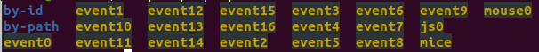
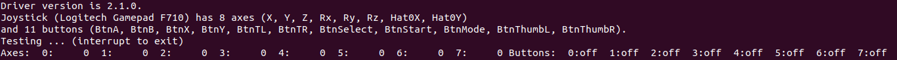
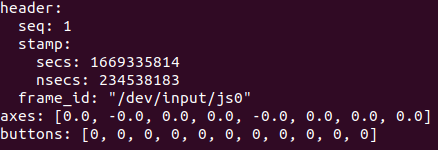

# JOY Para Teleoperación de Rober

Este repositorio contiene un script en Python para la teleoperación de un ROBER por medio de ROS.
## Instalación
Para la instalación del nodo de JOY se corre en terminal el siguiente comando.

    sudo apt-get install ros-"ROS_VERSION"-joy
  Remplazando ""ROS_VERSION" por la versión de ROS que se planea utilizar

## Configurando el Joystick
Una vez instalado el nodo de Joy procedemos a configurar el joystick para que ROS lo reconozca correctamente.
Primero introducimos el comando

    ls /dev/input/

Se encotrara una lista de dispositivos conectados, para indentificar el joystick buscamos dispositivos con la nomenclatura "jsX".

En caso de nesecitar indentificar entre varios dispositivos se puede probar por medio del comando 

    sudo jstest /dev/input/jsX

Este comando nos va a permitir ver el nombre del dispositivo y a su vez probar si correcto funcionamiento.

Finalmente tenemos que dar permisos de funcionamiento al joy para lo cual utilizamos el comando 

    ls -l /dev/input/jsX

En caso de que la configuracion no sea exitosa  podemos usar el comando 

    sudo chmod a+rw /dev/input/jsX
    
## Iniciar Nodo Joy en ROS

En primer lugar nos cersioramos que ROS este corriendo.
 
A continuacion tenemos que configurar en nodo de joy para que utilice nuestro dispositivo por defecto, para ello utilizamos el comando 

    rosparam set joy_node/dev "/dev/input/jsX"

Ahora iniciamos el nodo con el comando 

    rosrun joy joy_node
Si le realizamos un echo al topico veremos 

    rostopic echo joy
    
    

## Iniciar  Nodo Teleoperacion 
Finalmente ya podemos iniciar nuestro nodo de teleoperacion, para ello vamos a la carpeta donde tenemos guardado nuestro codigo y procedemos a correrlo.

    python Joy.py

## Funcionamiento 
El nodo cuando no esta recibiendo ningun comando por defecto detendra al Rober.
Las configuraciones de botones para el funcionamiento de el nodo son 
| COMBINACION TECLAS |FUNCION| 
|--|--|
|LB+LEFT ANALOG HORIZONTAL |MOVIMENTO SOBRE PROPIO EJE|
|LB+RIGHT ANALOG VERTICAL |MOVIMIENTO VERTICAL |
|RB+A|MODO MANUAL|
|RB+B|MODO AUTOMATICO FOLLOW ME|
|RB+X|MODO CONTROL POR GESTOS|

## Autor
Mario Mejia 
